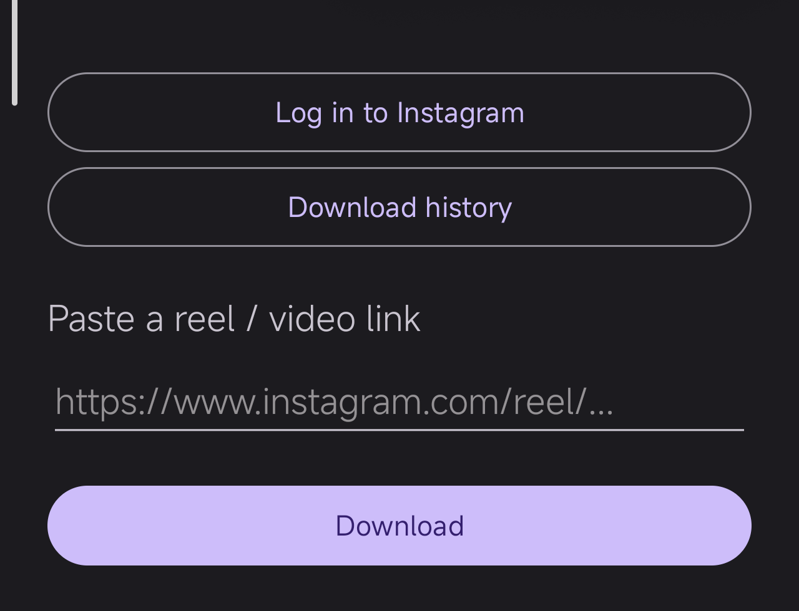

<div align="center">


# Mone

**Download videos from Instagram, Pinterest, X & 1000+ sites — straight to your gallery.**

A clean, open-source Android video downloader powered by [yt-dlp](https://github.com/yt-dlp/yt-dlp).

<br/>

[](https://github.com/AMREESHAYS/Mone/releases/latest)
[](https://github.com/AMREESHAYS/Mone/releases)
[](LICENSE)
[](https://github.com/AMREESHAYS/Mone/stargazers)


<br/>

<a href="https://github.com/AMREESHAYS/Mone/releases/latest">

</a>

</div>

<br/>

<div align="center">

</div>

<br/>

## ✨ Features

- 🔗 **Paste & download** — reels, posts, and videos from 1000+ sites yt-dlp supports.
- 🖇️ **Download queue** — paste multiple links at once; they process a few at a time with a live list and per-item cancel.
- 🌆 **Image links too** — direct image URLs are fetched straight to your gallery.
- 📲 **Share to Mone** — share a reel straight from Instagram into the app. No copy-paste.
- 🔐 **In-app Instagram login** — sign in with your own account for login-gated reels. Your session is kept in the app's private internal storage (not readable by other apps) and never shared.
- 🎬 **Best quality** — grabs the best single file, or downloads video + audio separately and merges them with ffmpeg.
- 🖼️ **Saves to your gallery** — into a dedicated `Mone` folder.
- 💬 **WhatsApp status saver** — browse statuses you've viewed and save any photo or video to your gallery in a tap.
- 🔔 **Notifications** — live download progress, tap when done to play.
- 🕑 **History** — everything you've downloaded, one tap to replay.

## 📥 Install

> [!IMPORTANT]
> **Requires a 64-bit Android phone** (`arm64-v8a`) running **Android 7.0+**. The download engine (embedded Python + yt-dlp + ffmpeg) ships 64-bit binaries only, so Mone **cannot install on 32-bit-only devices** (`armeabi-v7a`) — you'll get `INSTALL_FAILED_NO_MATCHING_ABIS`. Practically every phone since ~2017 is 64-bit; only some very low-end/old models are affected.

1. Download the latest **`Mone-vX.Y.Z.apk`** from the [**Releases**](https://github.com/AMREESHAYS/Mone/releases/latest) page.
2. Open it on your Android phone and allow **install from unknown sources**.
3. On first launch, grant **All files access** (to save into the `Mone` folder) and **notifications**.

> Sideload only — not on Google Play, by design.

### 📱 Xiaomi / MIUI / HyperOS users — important

MIUI aggressively freezes background apps, which can interrupt downloads. For reliable **background downloads**, give Mone these once:

1. **Autostart** — Settings → Apps → **Mone** → enable **Autostart**
   *(or Security app → Permissions → Autostart → turn on Mone).*
2. **No battery restrictions** — Settings → Apps → **Mone** → **Battery saver** → set to **No restrictions**.
3. **Lock in recents** — open Recents, swipe down on Mone's card (or long-press it) → tap the **lock** 🔒 so the system won't kill it.

Other heavy-handed skins (Samsung One UI, Oppo/Realme ColorOS, Vivo Funtouch) have similar "Autostart" / "Allow background activity" toggles — enable them for Mone too.

## 🚀 Usage

- **Any video:** paste the link and tap **Download**.
- **Instagram reels:** tap **Log in to Instagram** once and sign in with your own account, then download.
- **From other apps:** hit **Share → Mone** and confirm.

## 🛠️ Build from source

Requires Android Studio, JDK 17+, and a device/emulator (`arm64-v8a` or `x86_64`).

```bash
git clone https://github.com/AMREESHAYS/Mone.git
cd Mone
./gradlew assembleDebug
# → app/build/outputs/apk/debug/app-debug.apk
```

## 🧩 How it works

Mone is a thin Kotlin front-end. The heavy lifting is done by:

| Layer | Library |
|-------|---------|
| Download engine | [**yt-dlp**](https://github.com/yt-dlp/yt-dlp) (embedded Python via [yt-dlp-android](https://github.com/ffmpegkit-maintained/yt-dlp-android)) |
| Media merging | [**ffmpeg-kit**](https://github.com/ffmpegkit-maintained/ffmpeg-kit) |
| Auth | WebView Instagram login → local cookies |

## ⚠️ Limitations

- Instagram reels require logging in with your own account.
- Uses the free/LGPL ffmpeg build — some codecs and max-resolution merges may be limited.
- yt-dlp is bundled at a fixed version; sites change often, so an extractor can break until the library updates.
- Built on a young third-party library — treat as experimental.

## 🤝 Contributing

Issues and pull requests are welcome. Fork it, branch, and open a PR.

## 📄 Disclaimer

Mone is for **personal use only**. Downloading content may violate the terms of service of Instagram, YouTube, Pinterest, and other platforms, and redistributing others' content may infringe copyright. **You are solely responsible for how you use this app.** It is not affiliated with, endorsed by, or connected to any of these platforms.

## 🙏 Credits

- [yt-dlp](https://github.com/yt-dlp/yt-dlp) — the download engine
- [yt-dlp-android](https://github.com/ffmpegkit-maintained/yt-dlp-android) — Android bindings
- [ffmpeg-kit](https://github.com/ffmpegkit-maintained/ffmpeg-kit) — media muxing

## 📜 License

[GPL-3.0](LICENSE) © [AMREESHAYS](https://github.com/AMREESHAYS)

<div align="center">
<br/>
Made with 🍌 and yt-dlp
</div>
